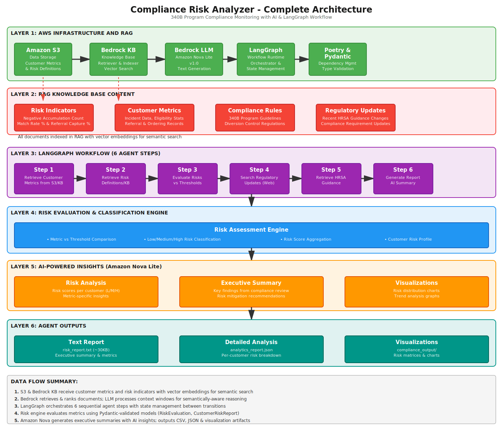

# 🏥 Compliance Risk Analyzer

**340B Program Compliance Risk Monitoring System**

Based on customer metrics, this system automatically analyzes if healthcare organizations are in 340B compliance risk and generates comprehensive risk reports with AI-powered insights.

---

## 📊 System Architecture

### Architecture Overview

The system consists of 6 integrated layers:

---

## 🎯 Layer 1: AWS Infrastructure & RAG (Simplified)

**What is Layer 1?**

Layer 1 is the foundation that gathers and prepares all the information needed to check compliance. Think of it as a smart librarian:

| Component | What It Does | Simple Analogy |
|-----------|-------------|-----------------|
| **Amazon S3** | Stores customer data and risk definitions | File cabinet with all the records |
| **Bedrock KB** | Indexes and organizes all documents for fast searching | Card catalog that helps find information quickly |
| **Bedrock LLM** | The AI brain that understands and generates text | Smart assistant who reads and writes |
| **LangGraph** | Orchestrates the entire workflow step-by-step | Project manager directing all the work |
| **Poetry & Pydantic** | Manages dependencies and validates data quality | Quality control ensuring everything is properly formatted |

**How they work together:**
1. S3 provides the data → Bedrock KB indexes it → LLM understands it
2. External APIs bring in the latest compliance rules
3. LangGraph coordinates everything in the right order
4. All data is validated to ensure correctness

---

## 🔑 Key Features

- ✅ **Multi-step Orchestration**: LangGraph manages the workflow execution order
- ✅ **Risk Classification**: Each customer metric evaluated against thresholds (Low/Medium/High)
- ✅ **Real-time Data**: Pulls latest compliance updates from DuckDuckGo and HRSA web searches
- ✅ **AI-Generated Reports**: Amazon Nova creates executive summaries with risk insights
- ✅ **Type Safety**: Pydantic models validate data (RiskEvaluation, CustomerRiskReport)
- ✅ **Knowledge Base Integration**: AWS Bedrock retrieves pre-indexed risk definitions and metrics

---

## 📖 Documentation

- [How It Works](HOW_IT_WORKS.md) - Detailed explanation of the workflow and data flow
- [Workflow Details](WORKFLOW.md) - Technical workflow specifications
