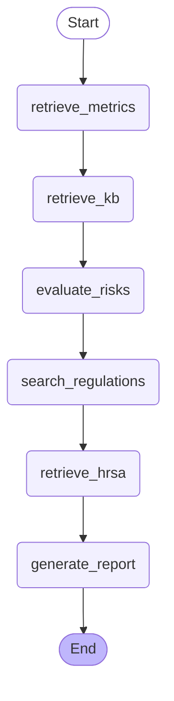

# Compliance Risk Analyzer - Workflow

## Graph Structure

## Node Descriptions

- **retrieve_metrics**: Fetch customer metrics from Bedrock Knowledge Base
- **retrieve_kb**: Fetch risk definitions from Bedrock KB & pre-index risk descriptions
- **evaluate_risks**: Evaluate metrics against thresholds, generate risk evaluations
- **search_regulations**: Search DuckDuckGo for regulatory updates
- **retrieve_hrsa**: Search DuckDuckGo for latest HRSA 340B guidance
- **generate_report**: Generate Claude summary + formatted compliance report
